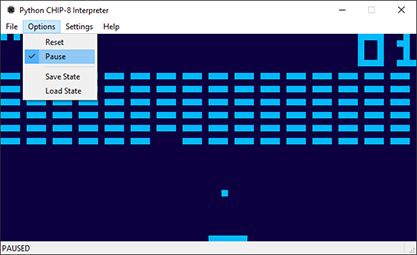
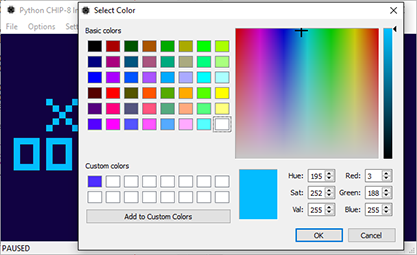
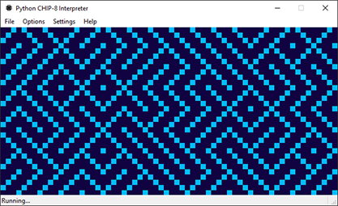
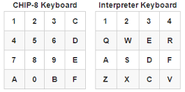

# Python CHIP-8 Interpreter

## Description:
A Python based GUI implementation of the CHIP-8 system. A project I developed with the intention of gaining knowledge about emulators and cross platform GUI libraries.
For more specific information about the CHIP-8 system, please refer to the following technical reference article on [CHIP-8](http://devernay.free.fr/hacks/chip8/C8TECH10.HTM) and the [WIKI](https://en.wikipedia.org/wiki/CHIP-8).

	
	

	
	

## Features:
- Implementation of all 35 CHIP-8 opcodes
- Custom pixel and background colour rendering
- Saving and loading of emulation state
- Sound effect support

## Supports:
- Microsoft Windows 7, 8, 8.1, 10
- Linux based distributions
- Mac OS X

## ROMs:
ROMs for the CHIP-8 system can be downloaded for free at [Chip8.com](http://www.chip8.com/?page=84) and [Zophar's Domain](http://www.zophar.net/pdroms/chip8.html). In order to load these ROMs with the interpreter, the files must be renamed to have a `.c8` extension.

## Dependencies:
- Python 3 [(Build 3.4)](https://www.python.org/downloads/)
- PyQt 4 [(Build 4.11)](https://riverbankcomputing.com/software/pyqt/download)

## Running the Interpreter:
1. Download and install Python 3
+ Download and install PyQt 4
+ To launch the interpreter, open a terminal or command prompt and type `python3 interpreterapp.py`
+ To load a ROM, ensure that the ROM file has a `.c8` extension

## Controls:
The CHIP-8 system uses a `hexadecimal keyboard` that has 16 keys from 0 to 9 and A to F. Keys `2`, `4`, `6` and `8` are typically used for directional input.

The following keyboard layouts specify the `CHIP-8 Keyboard` and the `Interpreter KeyBoard` used in the application.

	

## License:

